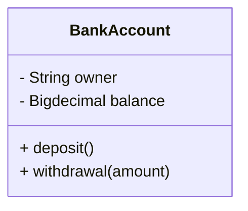

# BookMyShow

## Requirements
- Display all the movies available in a city

- User can search movies by their title, language, city, genre etc

- A theatre may have mulitple screens, and each screen must run one show at a time

- System must show number of seats available for a show

- Users must be able to book available seats

- System must not allow 2 users to book for a single seat

- system must be able to accept payment through paytm, credit, debit, UPI etc

#

## Class Diagram

