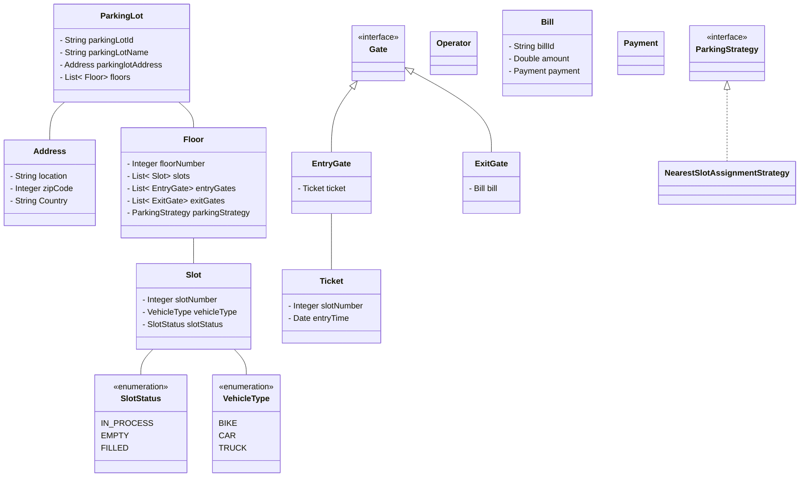

# Design a Parking Lot Management System

### Gather Requirements
```
1. Multiple floors
2. Each floor have multiple entry and exit gates
3. Each floor must have multiple slots
4. A slot can be of different size [EASY, MEDIUM, HARD]
5. An operator should be able to generate ticket at entry point of vehicle
6. Multiple vehicle type [BIKE, CYCLE, CAR]
7. Different slot allocation strategy
8. Parking fees will depend on duration and vehicle type
9. Operator must be able to generate bill at the exit point of vehicle
10. User should be able to pay through different payment modes, sytem should also support partial payment
```


---
### Class Diagram
