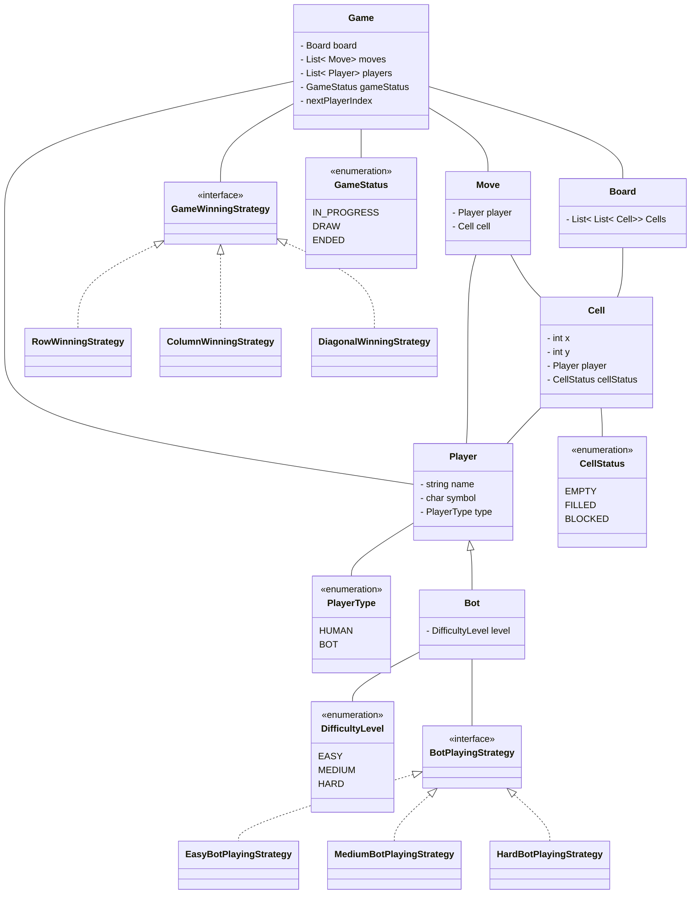

# Design a TicTacToe

### Gather Requirements
```
- Board can be of nxn size.
- Game will have n-1 players.
- Every player can choose their symbol as any char at the start of the game.
- Each player will have different symbol.
- At the start of game we randomize the list of players and play in that order.
- A game will have human and bot player.
- Bot will have difficult level of easy, medium and hard.
- Board will consists of cells.
- Any player can make a undo move.
- A Game will have game status like in progress, finished, draw.
- Game can have multiple winning algorithm.
- A Game will stop once we got first winner or game is drawn.
```


---
### Clarifying Requirements
```
Ex: How will game start?
    How many undo moves a player can make?
```


---
### Class Diagram



---
### Schema Design
```
Not needed in this.
```


---
### Code
```

```