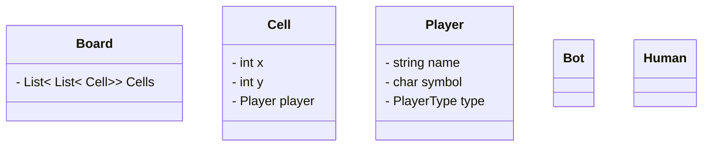

# Design a TicTacToe

### Gather Requirements
```
- Board can be of nxn dimensions.
- A game will have human and bot player.
- Bot will have difficult level of easy, medium and hard.
- Each player will have different symbol.
- Game will have n-1 player.
- Randomly select a player to start a game.
- Board will consists of cells.
- Any player can do undo.
- Game can have multiple winning strategy.
```


---
### Clarifying Requirements
```

```


---
### Class Diagram



---
### Schema Design
```

```


---
### Code
```

```