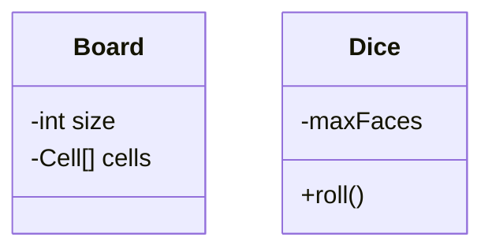

# Snake and Ladder 

## Requirements:
- Board can be of N size
- A game can have multiple number of dices.
- A dices can have F number of faces.
- A game can have multiple players.
- A game will have only human players.
- Each player can have multiple pieces.
- A board can have different types of cells.
- A cell can have snakes or ladders.
- A game will end if all players except one reached the last cell.

## Class Diagram:

