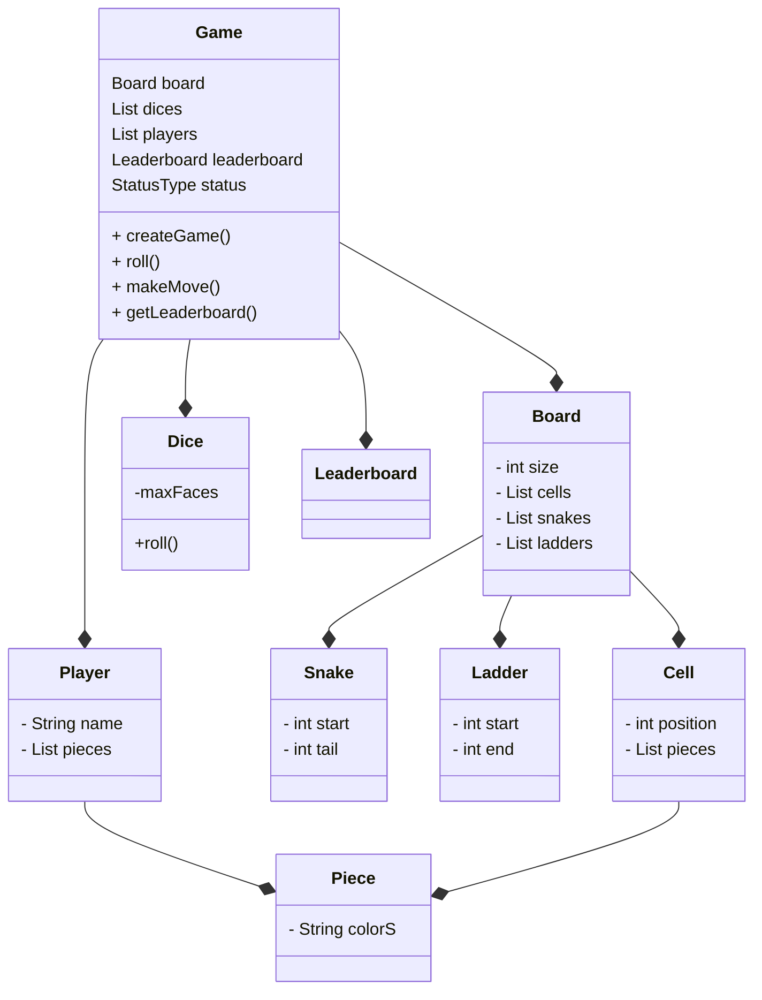
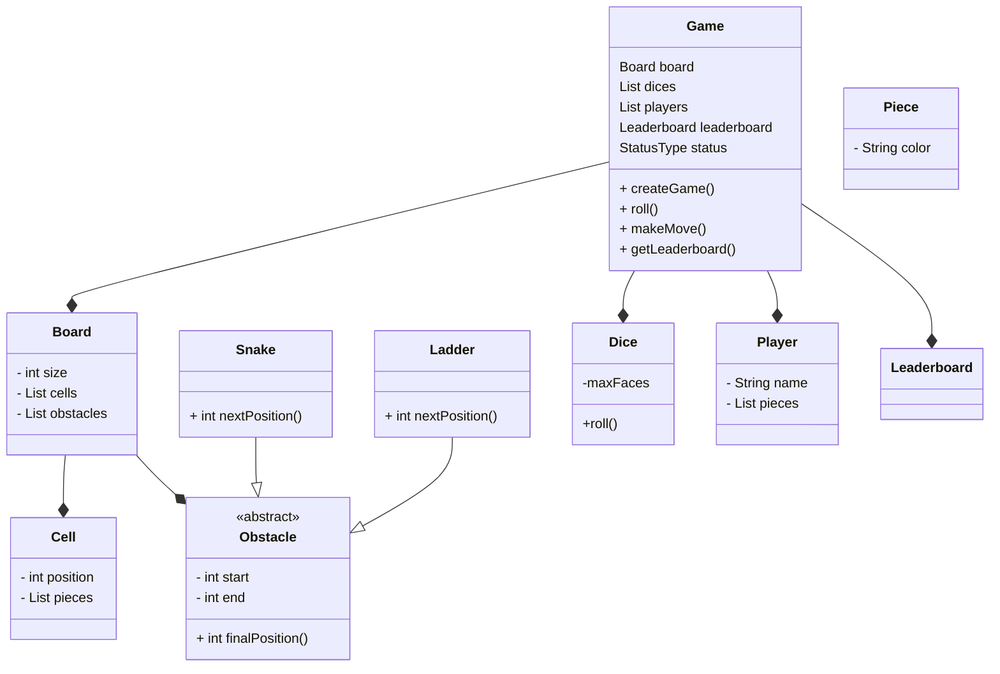
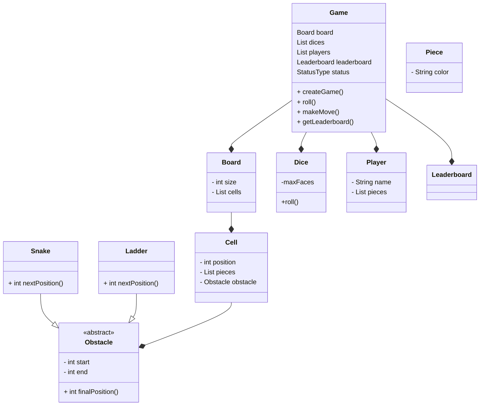

# Snake and Ladder 

## Requirements:
- Board can be of N size
- A game can have multiple number of dices.
- A dices can have F number of faces.
- A game can have multiple players.
- A game will have only human players.
- Each player can have multiple pieces.
- A board can have different types of cells.
- A cell can have snakes or ladders.
- A game will end if all players except one reached the last cell.

## Class Diagram:

Version 1:



---
Version 2:


---

Version 3:



---

## Final Diagram | Discussion

### Snake and ladder - LLD

### Block Diagram:
```
Game:
	Board board
	Queue<Player> players
	List<Dice> dices
	initializeGame()
	runGame()
		while(queue.size()!=1)
			rollDice()
			validation(Board board, int score)
			movePlayer(int score, Player player, Board board)
			checkWinner()
		

Board:
	int size;
	List<Cell> cells

Cell:
	int cellNumber;
	int start;
	int end;

EmptyCell:
	int start;
	int end;

Snake:
	int start;
	int end;

Ladder:
	int start;
	int end;

Player:
	String name;
	List<Piece> pieces;
	move()

Piece: 
	String color;
	


1 2 3 4 5 6 .. 100
e e e l e s
```
----------------------------------v1------------------------------------------
```
Block Diagram:

Game:
	Board board
	Queue<Player> players
	List<Dice> dices
	initializeGame()
	runGame()
		while(queue.size()!=1)
			rollDice()
			validation(Board board, int score)
			movePlayer(int score, Player player, Board board)
			checkWinner()

Board:
	int size;
	Map<int, Cell> cells;

Obstracle:
	int head;
	int tail;

Snake:
	
Ladder:

Frog:

Cell:
	int cellNumber;
	Obstracle obstracle;

Dice:
	int noOfFaces;
	roll(noOfFaces)
```
------------------------------------final--------------------------------------
