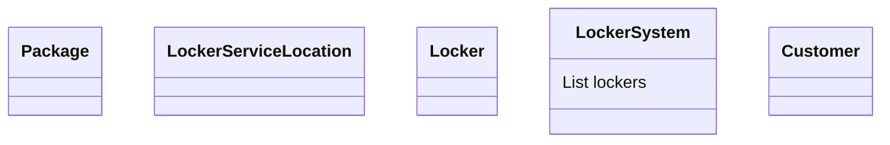

# Amazon Locker Service - LLD

## Requirements:
```
ORDER PLACEMENT:
1. Customer can choose nearest locker service for pick up

LOCKER ASSIGNMENT:
1. System should be able to allocat specific locker based on package size and locker availability
2. Locker and packages can be of different sizes

PACKAGE DELIVERY:
1. The package is then shipped to the assigned locker unit

CUSTOMER NOTIFICATOIN:
1. Once package is been delivered, user will be notified with the unique code and locker unit location

CUSTOMER PICKUP:
1. Customer will enter unique code in a display board.
2. If code is valid, locker will be opened. 
3. Expire unique code once it is used.
4. If package is not picked up within 3 days, return request will be initiated
```
---
## Classes and Objects:
```
1. Customer
2. Locker
3. Package
4. DisplayBoard
5. LockerServiceLocation
6. LockerSystem
```
---

## Class Diagram:

